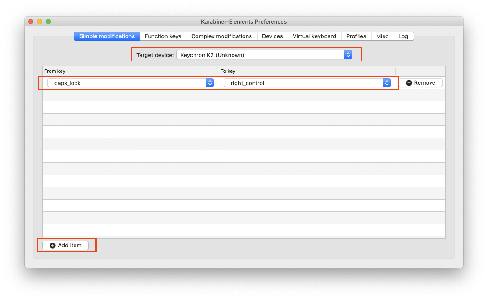
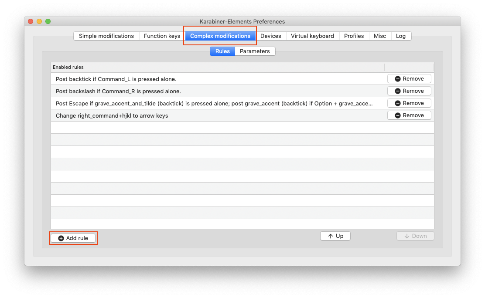
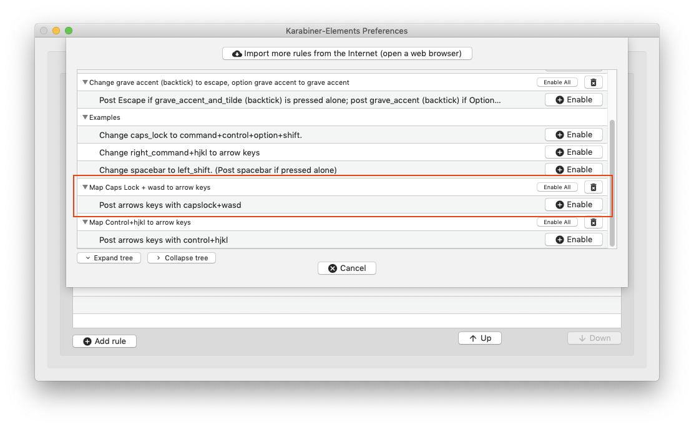

# custom keymaps using complex modifications in karabiner-elements

---

## remap caps lock to caps lock + WASD as arrow keys:

### installation:
```
git clone git@github.com:wheelsandbytes/karabiner-custom-maps.git
cd karabiner-custom-maps/
cp capslock-wasd-to-arrow-keys.json ~/.config/karabiner/assets/complex_modifications/
```

go to karabiner-elements in the menu bar -> Preferences...

under 'simple modifications' add the following mapping:



under 'complex modifications' enable the custom mapping that was copied from the repo:




